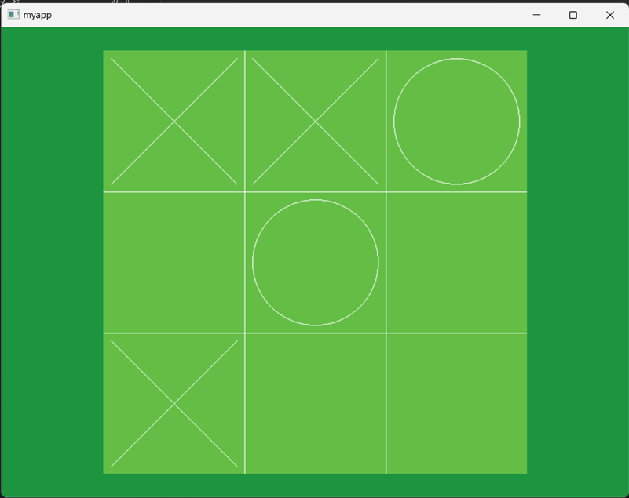
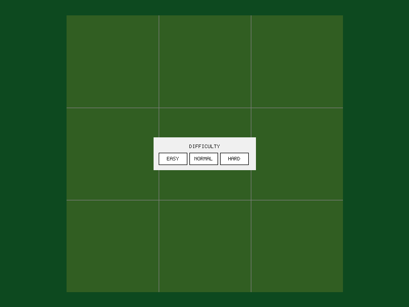
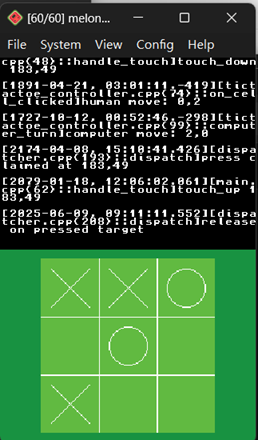
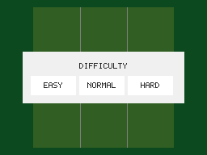

# Imprint

> 本ファイルは英語版 README の翻訳です。内容は [README.md](README.md) が正（2026-08-23 時点）。

[](README.md) [](README.zh-CN.md) [](README.ja.md)

[](LICENSE)
[]()
[]()


**一つのピクセルバッファで、すべてのターゲットへ。** Imprint は依存ゼロ・ソフトウェアレンダリングの C++17 UI フレームワークです。同じソースツリーが、ニンテンドーDS、Linux（フレームバッファまたは X11）、Windows、macOS（AppKit）、ブラウザ（WebAssembly）、そして C-ABI 経由の Python ホストで動作します。

| Windows | Linux (X11) | WebAssembly |
|:---:|:---:|:---:|
|  |  |  |

| ニンテンドーDS | Python ホスト |
|:---:|:---:|
|  |  |

## 特徴

- **保持モードのウィジェットツリー** — `Button`、`Label`、`Dialog`、`FlexPanel`、`GraphicsView` など
- **デザインファイル** — 極小テキスト形式（`.ui`）で UI を記述し、ビルド時に検証して C 配列にパック。どのターゲットでも配列からロード。プレビューアプリはファイルを直接描画
- **生のピクセルバッファへのソフトウェア描画** — GPU 不要、外部レンダリングライブラリ不要。バッファ形式はビルド時に `COLOR_DEPTH` で固定
- **決定的なオンデマンド再描画** — ダーティトラッキング、メインループはシェルが所有、隠れた再描画なし
- **C-ABI を第一級市民として** — 安定した `zbapi` C インターフェースに、Python（ctypes）、WebAssembly、C スモークテストのホスト
- **契約による自動化親和性** — 「ホストがすべてを駆動する」モデルにより、スクリプトがユーザーの代わりを務められる：入力を与え、フレームをポンプし、ピクセルにアサート。シングルスレッドでタイマーなしのためドライバに sleep 不要——テストバッテリーには公開 API のみで駆動するエンドツーエンドの `automation` スイートを含む
- **組み込みグレード** — RTTI なし、16 ビットカラー（abgr1555）、整数専用ジオメトリオプション、非アトミック参照カウントオプション（NDS に libatomic なし）
- **ゼロアロケーションのホットパス** — RAII の `ClipGuard`、イベントのトゥームストーン、`Subscription`
- **テキストは全体で UTF-8** — 組み込みの 5x7 ビットマップグリフフォールバック（ソース文字列から自動サブセット化）。FreeType（フォント）と vendored stb コーデック（PNG/JPEG）はオプション
- **C++17、CMake、静的ライブラリ** — すべて組み合わせ可能、強制されるものはなし

## クイックサンプル

```cpp
#include "imapp.hpp"
#include "imui.hpp"

int main()
{
    auto app = zb::app::make_app();
    app->create_window(320, 240);
    auto* win = static_cast<zb::app::CanvasWindow*>(app->window().get());

    auto btn = std::make_unique<zb::ui::Button>();
    btn->set_size(100, 40);
    btn->set_text("クリック");
    btn->clicked += [] { printf("こんにちは！\n"); };
    win->root().add_child(std::move(btn));

    app->paint();
}
```

同じ画面をデザインファイルで記述（`tools/examples/menu.ui`）：

```
column id="root" spacing=6 padding=10
  label id="title" text="Settings"
  checkbox id="sound" text="Sound"
  slider min=0 max=100 step=10
  list_box rows=3 items="Easy" "Normal" "Hard"
  row spacing=4
    button id="ok" text="OK"
    button id="cancel" text="Cancel"
```

ビルド時に `ui_embed` でパック（不正なファイルはビルドエラー）、実行時は
`parse_ui_text` + `build()` で実体化 — 全プラットフォーム同一コードパス。
プレビューはこのように：

```
UI_PREVIEW_FILES="tools/examples/menu.ui" cmake -B build/build_linux -DSTORY=ui_preview -DIM_SHELL_BACKEND=FB && cmake --build build/build_linux
```

## ビルド

| ターゲット | コマンド | 備考 |
|---|---|---|
| Windows（MSVC） | `cmake -S . -B build/build_win && cmake --build build/build_win` | 依存ゼロのデフォルト（32bpp） |
| Windows + フォント | `cmake -S . -B build/build_font -DUSE_FONT=ON && cmake --build build/build_font` | 実行には `freetype.dll` が PATH 上に必要 |
| macOS（AppKit） | `cmake -S . -B build/build_mac && cmake --build build/build_mac` | deployment target 11.0、追加オプション不要 |
| Linux（X11） | `cmake -S . -B build/build_linux -DIM_SHELL_BACKEND=X11 && cmake --build build/build_linux` | 入力対応バックエンド |
| Linux（フレームバッファ） | `cmake -S . -B build/build_linux -DIM_SHELL_BACKEND=FB && cmake --build build/build_linux` | 表示のみ。操作は X11 で |
| ニンテンドーDS | `docker run --rm -v $PWD:/src -w /src devkitpro/devkitarm:20260610 sh -c 'cmake -S . -B build/build_nds -DCMAKE_TOOLCHAIN_FILE=cmake/nds.toolchain.cmake && cmake --build build/build_nds'` | `build/build_nds/bin/tictactoe.nds` を生成 |
| WebAssembly | `demo/wasm/build.sh`（docker emscripten） | node スモークテスト付き |
| Python | `binding` 共有ライブラリをビルドしてから `SDL_VIDEODRIVER=dummy python3 demo/python/myapp.py --lib <libzbapi>` | ctypes + pygame ホスト |

テスト：`test/test_imui`——素の assert、テストフレームワークなし。デスクトップビルドで自動実行、NDS ではスキップ。

## ドキュメント

**推奨読書順序**（新しいメンテナーの初回）：
1. この README → **ビルド**（まずバイナリを動かす）
2. [`docs/ARCHITECTURE.md`](docs/ARCHITECTURE.md) §1–§2——システムの全体像、モジュールマップと依存ルール
3. [`docs/ARCHITECTURE.md`](docs/ARCHITECTURE.md) §3–§5——規範的契約、ターゲット、既知の制限
4. [`docs/code-contract.md`](docs/code-contract.md)——API レベルのインターフェース契約
5. [`docs/design-file.md`](docs/design-file.md)——`.ui` ファイルを扱うときに読む

**タスク別の参照先**：公開 API に触れる → 先に `code-contract.md`（契約が API に先行）· 新ターゲット / 新ピクセルフォーマット / 新ビルドオプション → ARCHITECTURE §6 · `.ui` 文法やパッケージング → `design-file.md` · C-ABI ホスト → `zbapi.h` + ARCHITECTURE §4.8 · ビルド/実行コマンド → 下の**ビルド**。

- [`docs/ARCHITECTURE.md`](docs/ARCHITECTURE.md)——実装済みアーキテクチャ：モジュールマップと依存ルール、契約（フレームライフサイクル、入力、ピクセルモデル、テキスト、イベント、エラー処理、C-ABI ホスト、ビルドオプション）、既知の制限、アーキテクチャバックログ
- [`docs/code-contract.md`](docs/code-contract.md)——API レベルのインターフェース契約：エラーパス、UTF-8/テキスト、glyph provider、ツリー変更、レイアウト無効化、アロケーション予算、プレゼンテーションシームのコンバータ
- [`docs/design-file.md`](docs/design-file.md)——`.ui` デザインファイル形式：文法、パッケージングパイプライン、実体化セマンティクス
- [`binding/include/zbapi.h`](binding/include/zbapi.h)——C-ABI ホストインターフェース。ホストルールは ARCHITECTURE §4.8

## デモ

デモアプリは三目並べ（人間 vs コンピュータ）。ダイアログ・ボタン・レイアウト・オンデマンド再描画を一通り使います。NDS ビルドは `build/build_nds/bin/tictactoe.nds` を生成します。2 つ目のアプリ `ui_preview`（`-DSTORY=ui_preview`）は `UI_PREVIEW_FILES`（スペース区切りのパス、左右キーでドキュメント切替）のデザインファイルを描画します。

## ライセンス

[MIT](LICENSE) © 2026 tyou hyou
