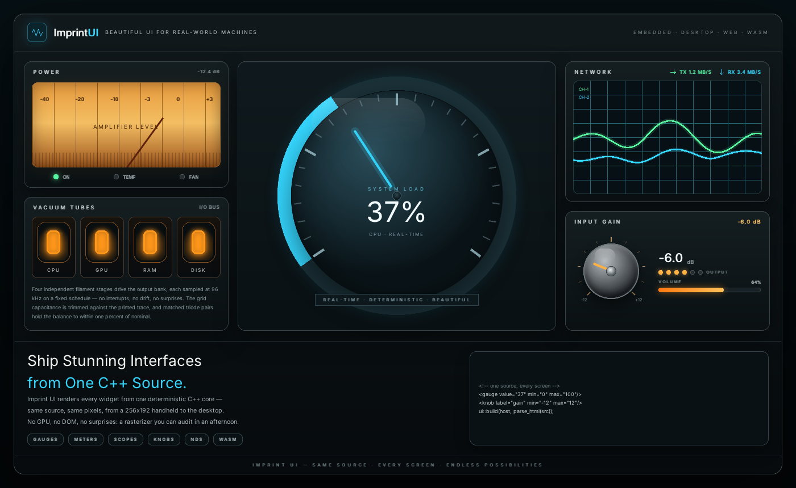

# Imprint UI

[](README.md) [](README.zh-CN.md) [](README.ja.md)

[](LICENSE)
[]()
[]()

**Same input, same pixels — assertable in CI, with no display attached.**

Imprint is a deterministic, embeddable UI runtime for C++17: one pixel
buffer, software-rasterized — no GPU, no OS GUI toolkit. The host drives
every frame, so an input sequence always yields the same frame bytes;
asserting UI logic pixel-by-pixel in headless CI is a property of the
contract, not a test-harness trick. One UI source tree — widgets in code,
or a screen described in a design file — compiles unchanged for Windows,
Linux, macOS, WebAssembly, the Nintendo DS, and any C host via `zbapi`.

**Design-first.** The console below is *drawn in HTML* — no widget code —
and rendered by Imprint's own software rasterizer into that same buffer:

<p>
  
</p>

Not a mockup — a live widget tree. Designers hand over HTML or the compact
`.ui` format; both materialize into the exact tree your C++ builds, so the
design is what ships on every target. The HTML path is spelled out after
the `.ui` example below; either way, one tree, one buffer, many targets.

**One UI source tree. One pixel buffer. Many targets.**

The same design-file showcase — a warm terminal punched into the pixel
buffer — on desktop, on the Nintendo DS, and in the browser:


**[Try it live in your browser](https://tyouhyou.github.io/imprint/)** —
the page runs the WebAssembly build of the widget showcase; the frame
below is that app recorded end to end (desktop, browser, and DS ROMs are
built from the same sources):


No GPU required. No OS GUI toolkit required. No platform-specific UI code.

```
              same UI source
                    │
        ┌───────────┼───────────┐
        ↓           ↓           ↓
     Windows       Linux      macOS
        │        (X11/FB)       │
        └───────────┼───────────┘
                    ↓
             WebAssembly  ←  try it in your browser
                    ↓
              Nintendo DS
                    ↓
         your embedded board (C-ABI)
```

Measured footprints (Release builds of the `showcase` app above):

| Target | UI code+data | RAM (statics) | Framebuffer | Shipped size |
|---|---|---|---|---|
| Nintendo DS | 543 KB text + 11 KB data | 7.7 KB BSS | 96 KB (256×192×2 B) | 646 KB `.nds` |
| WebAssembly | — | — | 256×192×4 B | 250 KB single `.js` file, runs from `file://` |

## Highlights

- **Deterministic, host-driven runtime** — shell owns the loop; same input sequence → same pixels; repaint-on-demand with dirty tracking, no hidden redraws
- **Automation by contract** — a script can replace the user: feed input, pump frames, assert on pixels; single-threaded and timer-free, so drivers never sleep — the test battery includes an end-to-end `automation` suite driven through the public API
- **Design files** — describe a screen in `.ui` or external HTML, validate and pack at build time, load from a C array on any target; `ui_preview` renders files directly
- **Retained-mode widget tree** — `Button`, `Label`, `Dialog`, `FlexPanel`, `ListBox` and more
- **Software rendering into a raw pixel buffer** — no GPU, no external rendering library; the buffer format is fixed at build time (`COLOR_DEPTH`)
- **C-ABI as a first-class citizen** — stable `zbapi` C interface with Python (ctypes), WebAssembly and C smoke-test hosts
- **Embedded-grade** — no RTTI, 16-bit color (abgr1555), integer-only geometry option, non-atomic refcounting option (NDS has no libatomic)
- **Zero-allocation hot paths** — RAII `ClipGuard`, event tombstoning, `Subscription`
- **UTF-8 text throughout** — built-in 5x7 bitmap glyph fallback (auto-subsetted from source strings); optional runtime TTF text via vendored stb_truetype, vendored stb codecs (PNG/JPEG) and a hand-written GIF writer
- **C++17, CMake, static libraries** — everything is composable, nothing is forced

## Non-goals

GPU-accelerated drawing (the render kernel stays CPU software rasterization) ·
animation/transition system · runtime backend switching · multithreaded
rendering · IME composition · RTL layout. Imprint deliberately stays small:
one widget tree, one pixel buffer, one input stream — everything else is the
host's job.

## Quick Example

```cpp
#include "imapp.hpp"
#include "imui.hpp"

int main()
{
    auto app = zb::app::make_app();
    app->create_window(320, 240);
    auto* win = static_cast<zb::app::CanvasWindow*>(app->window().get());

    auto btn = std::make_unique<zb::ui::Button>();
    btn->set_size(100, 40);
    btn->set_text("Click Me");
    btn->clicked += [] { printf("Hello!\n"); };
    win->root().add_child(std::move(btn));

    app->paint();
}
```

The same screen described as a design file (`tools/examples/menu.ui`):

```
column id="root" spacing=6 padding=10
  label id="title" text="Settings"
  checkbox id="sound" text="Sound"
  slider min=0 max=100 step=10
  list_box rows=3 items="Easy" "Normal" "Hard"
  row spacing=4
    button id="ok" text="OK"
    button id="cancel" text="Cancel"
```

Pack it at build time with `ui_embed` (fails the build on invalid files), then
`parse_ui_text` + `build()` materialize it — the same code path on every
platform. Preview interactively with the `ui_preview` app:

```
UI_PREVIEW_FILES="tools/examples/menu.ui" cmake -B build/build_linux -DSTORY=ui_preview -DIM_SHELL_BACKEND=FB && cmake --build build/build_linux
```

### HTML as an external designer

Prefer a real markup toolchain? The same materialization path accepts an
external **HTML** design file. The hero at the top of this README is
[`assets/designs/imprint_console.html`](assets/designs/imprint_console.html)
— open it in a browser to edit, hand it to Imprint's designer, and it
becomes the identical widget tree the C++ example builds above (an
`html` / `vectordial` subset: layout, labels, controls, vector dials —
not a web engine). Preview it the same way:

```
UI_PREVIEW_FILES="assets/designs/imprint_console.html" cmake -B build/build_html -DSTORY=ui_preview -DIM_SHELL_BACKEND=FB && cmake --build build/build_html
```

Both formats — `.ui` and HTML — feed one tree, one pixel buffer, every
target.

## Build

| Target | Command | Notes |
|---|---|---|
| Windows (MSVC) | `cmake -S . -B build/build_win && cmake --build build/build_win` | zero-dependency default (32bpp) |
| Runtime TTF text | `cmake -S . -B build/build_rt_ttf -DUSE_TTF_RUNTIME=ON && cmake --build build/build_rt_ttf` | runtime glyph rasterization (batch L-5): apps load a font via `TtfFamily`, no external dependency |
| macOS (AppKit) | `cmake -S . -B build/build_mac && cmake --build build/build_mac` | no deployment-target pin (toolchain default), no extra options |
| Linux (X11) | `cmake -S . -B build/build_linux -DIM_SHELL_BACKEND=X11 && cmake --build build/build_linux` | input-capable backend |
| Linux (framebuffer) | `cmake -S . -B build/build_linux -DIM_SHELL_BACKEND=FB && cmake --build build/build_linux` | presents only; use X11 for interaction |
| Nintendo DS | `docker run --rm -v $PWD:/src -w /src devkitpro/devkitarm:20260610 sh -c 'cmake -S . -B build/build_nds -DCMAKE_TOOLCHAIN_FILE=cmake/nds.toolchain.cmake && cmake --build build/build_nds'` | produces `build/build_nds/bin/tictactoe.nds`; add `-DSTORY=showcase` for the showcase ROM (it additionally needs the host-built `ui_embed` and `asset_gen` passed as `-DUI_EMBED_EXECUTABLE=` / `-DASSET_GEN_EXECUTABLE=`), or `-DSTORY=showcase_html` for the HTML showcase (same, plus the host-built `html_embed` as `-DHTML_EMBED_EXECUTABLE=`) |
| WebAssembly | `demo/wasm/build.sh` (docker emscripten) | includes a node smoke test |
| Python | build the `binding` shared lib, then `SDL_VIDEODRIVER=dummy python3 demo/python/myapp.py --lib <libzbapi>` | ctypes + pygame host |

Tests: `test/test_imui` — plain asserts, no test framework; run via `ctest -R test_imui` (or the binary) on desktop; skipped on NDS.

## Window & presentation

The app owns a **fixed-size pixel buffer** (`create_window(w, h)`) and
never re-lays out for a window resize. Desktop shells (win32 / X11 /
macOS) open the window at buffer size and let you resize it freely: the
buffer is presented scaled to fit, aspect preserved, centered on a black
letterbox, with nearest-neighbor resampling — the same buffer at the
same window size renders identically on every desktop platform. Pointer
input maps back through the same integer formula the stretch uses
(`buf = (win - dest) * buf / dest`), so hit-testing stays exact at any
scale; clicks on the letterbox are ignored. The NDS and framebuffer
shells present 1:1; WASM/Python hosts scale host-side.

## Documentation

**Suggested reading order** (first pass for a new maintainer):
1. [`docs/getting-started.md`](docs/getting-started.md) — run your first app and make it your own (~5 minutes)
2. this README → **Build** (get a binary running on every target)
3. [`docs/ARCHITECTURE.md`](docs/ARCHITECTURE.md) §1–§2 — what the system is, module map & dependency rules
4. [`docs/ARCHITECTURE.md`](docs/ARCHITECTURE.md) §3–§5 — the normative contracts, targets, limitations
5. [`docs/code-contract.md`](docs/code-contract.md) — the API-level contracts
6. [`docs/design-file.md`](docs/design-file.md) — when working with `.ui` files

**Where to look by task:** touching public API → `code-contract.md` first (the contract changes before the API) · new target / pixel format / build option → `docs/backlog.md` & ARCHITECTURE §4 · `.ui` grammar or packaging → `design-file.md` · C-ABI host → `zbapi.h` + ARCHITECTURE §4.8 · build & run commands → **Build** below.

- [`docs/getting-started.md`](docs/getting-started.md) — from a fresh clone to your own app: run the `hello` story, understand the `IApp`/`CanvasWindow` seam, register your own story
- [`docs/ARCHITECTURE.md`](docs/ARCHITECTURE.md) — the as-built architecture: module map & dependency rules, contracts (frame lifecycle, input, pixel model, text, events, errors, C-ABI hosts, build options), and known limitations
- [`docs/backlog.md`](docs/backlog.md) — the living backlog: architecture items, product feature batches (L/I/F), and condition-triggered items
- [`docs/code-contract.md`](docs/code-contract.md) — the API-level interface contract: error paths, UTF-8/text, glyph provider, tree mutation, layout invalidation, alloc budget, the presentation-seam converter
- [`docs/design-file.md`](docs/design-file.md) — the `.ui` design-file format: grammar, packaging pipeline, materialization semantics
- [`binding/include/zbapi.h`](binding/include/zbapi.h) — the C-ABI surface for hosts (Python, WASM, C); host rules in ARCHITECTURE §4.8

## Demo

**Hello** (`-DSTORY=hello`) — the getting-started app: a label and a click-counting button; copy it to start your own app (see [`docs/getting-started.md`](docs/getting-started.md)).

**Showcase** (`-DSTORY=showcase`) — the multi-target widget gallery: boots dark, opens on an animated chart drawn with the framework's own rasterizer (anti-aliased curve over a gradient area on a rounded card, revealed step by step by an app-side tween), a device-status control panel (progress bars, START/STOP, dark/light theme), and an all-widgets page with alpha asset compositing (a 9-slice shadow card and an accent-tinted ball; the assets are generated at build time by `tools/asset_gen`), and a factory-console dashboard page (gauges, a live trend chart, a setpoint knob+slider pair, pump/coolant toggles) whose SELF-CHECK button drives the knob through real drag events and stamps PIXELS MATCH when two renders of the same state hash the framebuffer byte-identically — the deterministic-runtime proof. The frames in `assets/showcase/` come from these builds — the recorder is fully deterministic, producing byte-identical GIFs on Windows, macOS and Linux; the WASM variant is playable online ([tyouhyou.github.io/imprint](https://tyouhyou.github.io/imprint/), built with `demo/wasm/build.sh showcase`), and the same sources build the NDS ROM.

**TicTacToe** (default story) — a human-vs-computer game exercising dialogs, buttons, layout and repaint-on-demand; the NDS build produces `build/build_nds/bin/tictactoe.nds`. A third app, `ui_preview` (`-DSTORY=ui_preview`), renders design files from `UI_PREVIEW_FILES` (space-separated paths; left/right keys switch documents) — pass `.ui` or HTML paths.

| Windows | macOS | Linux (X11) | WebAssembly | Nintendo DS | Python host |
|:---:|:---:|:---:|:---:|:---:|:---:|
|  |  |  |  |  |  |

## License

[MIT](LICENSE) © 2026 tyou hyou
