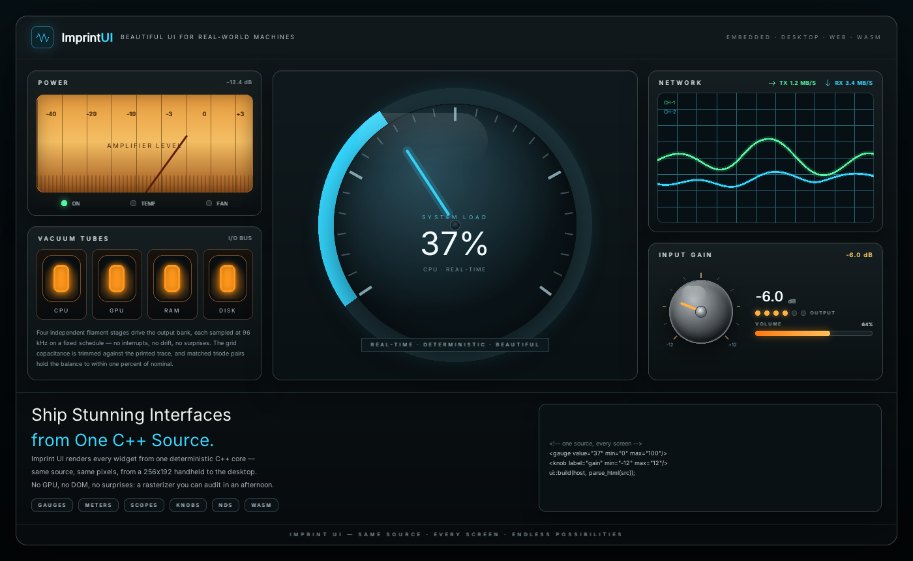
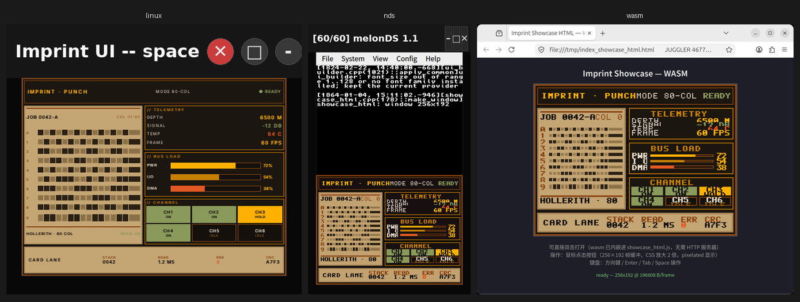
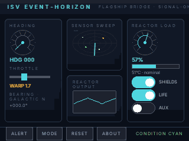
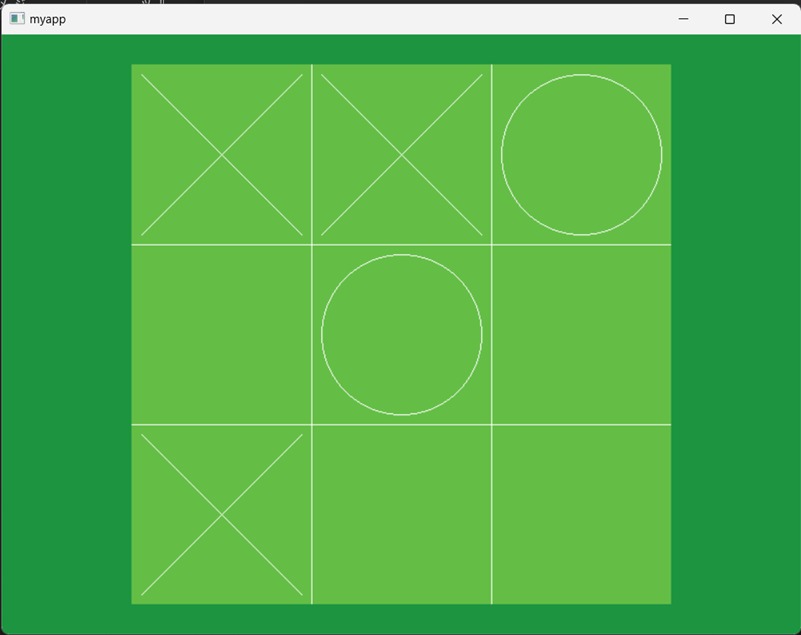
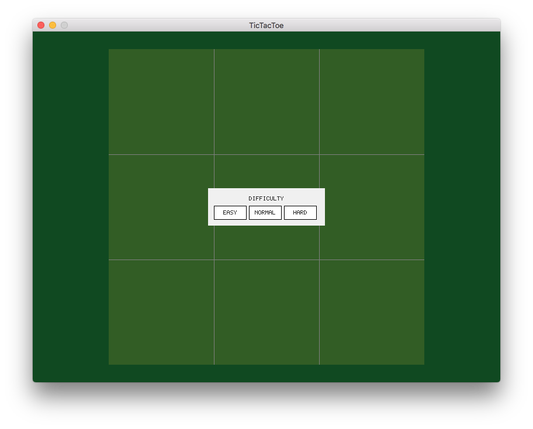
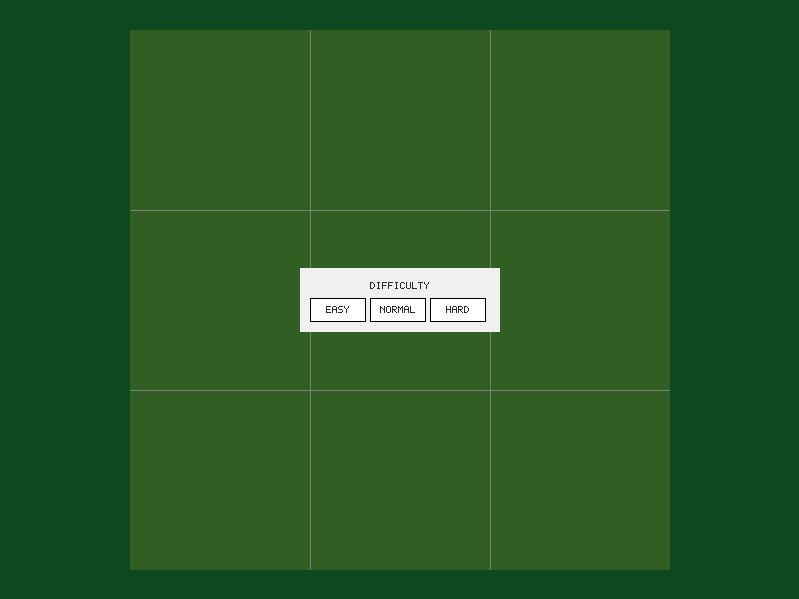
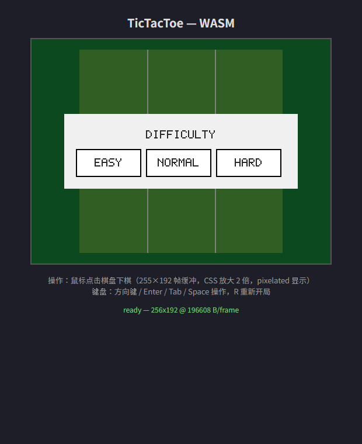
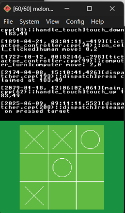
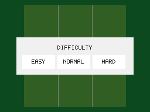

# Imprint UI

[](README.md) [](README.zh-CN.md) [](README.ja.md)

[](LICENSE)
[]()
[]()

**Same input, same pixels — assertable in CI, with no display attached.**

Imprint UI is a deterministic UI runtime for C++17: it draws your interface
into a raw pixel buffer with its own software rasterizer, and for a fixed
build and buffer size the same input sequence always yields the same
framebuffer bytes. One UI source tree compiles unchanged for Windows, Linux,
macOS, sixel terminals, WebAssembly, the Nintendo DS — and any language that
can call a C ABI.

<p>
  
</p>

*Not a mockup.* The image above is a single HTML design file, materialized
into a widget tree at build time and rendered into the pixel buffer by
Imprint's own rasterizer — the same tree your C++ ships on every target.

## Highlights

- **Deterministic rendering** — same input, same pixels, byte-identical across Windows / macOS / Linux
- **Headless by design** — a script fully replaces the user: no display, no Xvfb, no sleeps
- **Made for AI agents** — an agent writes a screen, drives it, and verifies its own work pixel-by-pixel
- **Pure CPU, zero dependencies** — no GPU, no OS GUI toolkit, no third-party rendering library
- **One source tree, six targets** — desktop, sixel terminal, browser, Nintendo DS, same code
- **Design-first** — screens described in HTML or `.ui`, validated and materialized at build time
- **Absurdly small** — ~705 KB single-file WebAssembly (font included); a Nintendo DS in 96 KB of VRAM
- **Any language via C-ABI** — Python, WASM, anything that can call C gets the same protocol

## Non-goals

GPU-accelerated drawing (the render kernel stays CPU software rasterization) ·
animation/transition system · runtime backend switching · multithreaded
rendering · IME composition · RTL layout. Imprint deliberately stays small:
one widget tree, one pixel buffer, one input stream — everything else is the
host's job.

## Deterministic rendering

For a fixed build and buffer size, the same input sequence always produces
the same framebuffer bytes — a property of the contract, not a test-harness
trick. Within one pixel class the hash is byte-identical across Windows,
macOS and Linux; repaint is on-demand with dirty tracking, no hidden
redraws. `zb::snap` (link `imprint::snapshot`) is the whole workflow:

```cpp
#include "snapshot.hpp"

// drive your surface headlessly (input/paint), then:
auto r = zb::snap::check(*app.window(), "main_view", "tests/baselines");
if (r.status == zb::snap::check_result::status::missing)
{
    zb::snap::record(*app.window(), "main_view", "tests/baselines");  // first run
}
// status::mismatch also ships tests/baselines/main_view.actual.gif for diffing
```

Baselines are valid per build configuration (code-contract §12.2) and are
committed by the host app that owns them: the framework ships the
record/check mechanism, it does not track baselines for you — Imprint's own
CI pins determinism with the two-run `imprint-render` byte comparison
(below), and `test/test_snapshot.cpp` exercises the record/check round-trip.
In-tree reference for a host suite: the showcase recorder, which rides the
same determinism.

## Headless by design

The shell owns the loop; the host drives every frame — feed input, pump
frames, assert on pixels. Single-threaded and timer-free, so drivers never
sleep: no display server, no Xvfb, no "wait 200 ms and screenshot". Our
Tier-1 CI runs exactly this — two renders of the same design file,
byte-compared:

```yaml
- run: |
    cmake --build build_ci --target imprint-render
    ./build_ci/bin/imprint-render tools/examples/menu.ui --out menu1.png
    ./build_ci/bin/imprint-render tools/examples/menu.ui --out menu2.png
    cmp menu1.png menu2.png   # two runs, byte-identical frames
```

No app code at all? `imprint-render assets/designs/imprint_console.html
--out hero.png` — the hero at the top of this README comes out of that one
line (it prints the frame hash too).

## Made for AI agents

An agent can write UI code, but it cannot open a window and look at the
result — until now the loop always broke at "someone eyeball the
screenshot". Imprint closes it. Because frames are deterministic and the
runtime is drivable through its public API with no display attached, an
agent can write a screen, pump frames, and *prove* the result pixel-by-pixel
— the same way our own test battery works, including its end-to-end
`automation` suite.

## Pure CPU, zero dependencies

The render kernel is a software rasterizer drawing into a raw pixel buffer;
the buffer format is fixed at build time (`COLOR_DEPTH`). PNG/JPEG codecs
are vendored stb, the GIF writer is hand-written, UTF-8 text has a built-in
5x7 bitmap glyph fallback (auto-subsetted from your source strings) with
optional runtime TTF (vendored stb_truetype). No GPU, no OS GUI toolkit, no
third-party rendering library. Embedded-grade where it counts: no RTTI,
16-bit color (abgr1555), integer-only geometry and non-atomic refcounting
options for libatomic-less toolchains, zero-allocation hot paths.

## One source tree, six targets

The same design-file showcase — desktop, Nintendo DS, browser:



Windows, Linux (X11 / framebuffer), macOS (AppKit), WebAssembly and the
Nintendo DS all run the same widget tree. The terminal is a first-class
target too: on any sixel-capable terminal (WezTerm, foot, iTerm2) the same
tree renders as SIXEL graphics with SGR mouse and keyboard input — no
windowing system at all. **[Try it live in your
browser](https://tyouhyou.github.io/imprint/)** — the ORION NX-07 command
deck compiled to WebAssembly, presented through the same C-ABI a desktop
shell uses.

## Design-first

A screen is *designed in HTML* — ids, tags, styles, zero widget code — or in
the compact `.ui` grammar; both materialize into the exact widget tree your
C++ builds (the HTML path is an `html` / `vectordial` subset: layout,
labels, controls, vector dials — not a web engine). Files are validated and
packed at build time: `ui_embed` fails the build on invalid files, and any
target loads the result from a C array. ORION, the command deck at the top,
is a 412-line HTML design file plus ~1,600 lines of C++ behavior. Preview any
design file interactively:

```
UI_PREVIEW_FILES="assets/designs/imprint_console.html" cmake -B build/build_html -DSTORY=ui_preview -DIM_SHELL_BACKEND=FB && cmake --build build/build_html
```

## Absurdly small

Measured footprints (Release builds of the showcase demo):

| Target | Shipped footprint |
|---|---|
| WebAssembly | 705 KB single `.js` file — wasm and the Inter TTF embedded, runs from `file://` |
| Nintendo DS | 256×192 16-bpp framebuffer (96 KB VRAM); integer-only geometry and non-atomic refcounting options for libatomic-less toolchains |

Retained-mode widgets: `Button`, `Label`, `Dialog`, `FlexPanel`, `ListBox`,
`TextInput`, `Slider` and more — C++17, CMake, static libraries, everything
composable, nothing forced.

## Any language via C-ABI

`zbapi` is a stable C interface — Python (ctypes + pygame), WebAssembly and
plain C hosts all drive the same protocol. The declarative path needs no C++
on your side at all: `zb_app_create_from_ui` builds the widget tree from a
design file (`.ui` grammar, or the HTML subset with `is_html=1` — the same
two front-ends the designer uses), and actions come back by id. The Python
demo is the whole story (`demo/python/ui_app.py`):

```python
UI = """
column id="root" spacing=8 padding=12
  label id="count" text="Clicks: 0"
  button id="inc" text="Count up"
"""

def on_action(widget_id, userdata):
    if widget_id == b"inc":
        clicks[0] += 1
        lib.zb_widget_set_text(app, b"count", ("Clicks: %d" % clicks[0]).encode())

app = lib.zb_app_create_from_ui(UI.encode(), 0, 320, 240)
lib.zb_set_event_callback(app, b"inc", action_cb, None)
# drive zb_input / zb_paint in your own loop -- the host is the shell
```

Static structure lives in the file; behavior lives in the host — the
declarative boundary is unchanged.

## Quick Example

```cpp
#include "imapp.hpp"
#include "imui.hpp"

int main()
{
    auto app = zb::app::make_app();
    app->create_window(320, 240);
    auto* win = static_cast<zb::app::CanvasWindow*>(app->window().get());

    auto btn = std::make_unique<zb::ui::Button>();
    btn->set_size(100, 40);
    btn->set_text("Click Me");
    btn->clicked += [] { printf("Hello!\n"); };
    win->root().add_child(std::move(btn));

    app->paint();
}
```

The same screen described as a design file (`tools/examples/menu.ui`):

```
column id="root" spacing=6 padding=10
  label id="title" text="Settings"
  checkbox id="sound" text="Sound"
  slider min=0 max=100 step=10
  list_box rows=3 items="Easy" "Normal" "Hard"
  row spacing=4
    button id="ok" text="OK"
    button id="cancel" text="Cancel"
```

Pack it at build time with `ui_embed` (fails the build on invalid files),
then `parse_ui_text` + `build()` materialize it — the same code path on
every platform.

## Your project, your main — use as a library

Nothing forces your application to live in this tree: add Imprint as a
subproject and drive it through `zb::shell::run` — the same host loop the
platform shells run:

```cpp
// your main.cpp — MyWindow : zb::app::CanvasWindow, or any zb::app::IApp
#include "shell/run.hpp"

#include "my_window.hpp"

int main()
{
    return zb::shell::run(std::make_shared<MyWindow>());
}
```

```cmake
# your CMakeLists.txt
add_subdirectory(imprint)          # or FetchContent
add_executable(my_app main.cpp)
target_link_libraries(my_app PRIVATE imprint::imapp_canvas imprint::shell_backend)
```

Prefer an installed package? `cmake --install <build> --prefix <prefix>`,
then `find_package(imprint CONFIG REQUIRED)` (point `CMAKE_PREFIX_PATH` at
the prefix) and link the same `imprint::` targets. As a subproject Imprint
configures **libraries only** — no demo apps, no binding, no host tools; the
`IMPRINT_WITH_TOOLS` / `IMPRINT_WITH_TESTS` / `IMPRINT_WITH_DEMOS` switches
re-enable each piece (the default in-tree build keeps them all). The
headless path — the one CI asserts pixels with — needs no shell at all:
`CanvasWindow::create()` + `paint()` (see `test/external_smoke/`, wired into
the test battery). The shell-loop contract is `docs/code-contract.md` §11.

One constraint worth knowing up front: **the buffer is fixed for the
lifetime of the window.** `create_window(w, h)` sizes it once (I-2a); there
is no runtime resize API. If the resolution must change, the supported route
is to recreate the app — tear down and `create_window` again with the new
size (code-contract §11.1).

## Build

| Target | Command | Notes |
|---|---|---|
| Windows (MSVC) | `cmake -S . -B build/build_win && cmake --build build/build_win` | zero-dependency default (32bpp) |
| Runtime TTF text | `cmake -S . -B build/build_rt_ttf -DUSE_TTF_RUNTIME=ON && cmake --build build/build_rt_ttf` | runtime glyph rasterization (batch L-5): apps load a font via `TtfFamily`, no external dependency |
| macOS (AppKit) | `cmake -S . -B build/build_mac && cmake --build build/build_mac` | no deployment-target pin (toolchain default), no extra options |
| Linux (X11) | `cmake -S . -B build/build_linux -DIM_SHELL_BACKEND=X11 && cmake --build build/build_linux` | input-capable backend |
| Linux (framebuffer) | `cmake -S . -B build/build_linux -DIM_SHELL_BACKEND=FB && cmake --build build/build_linux` | presents only; use X11 for interaction |
| Terminal (SIXEL) | `cmake -S . -B build/build_term -DIM_SHELL_BACKEND=SIXEL && cmake --build build/build_term` | demo target: the same UI in a sixel terminal (WezTerm/foot/iTerm2), input via SGR mouse + keys; `IM_TERM_SIZE=WxH` resizes |
| Nintendo DS | `docker run --rm -v $PWD:/src -w /src devkitpro/devkitarm:20260610 sh -c 'cmake -S . -B build/build_nds -DCMAKE_TOOLCHAIN_FILE=cmake/nds.toolchain.cmake && cmake --build build/build_nds'` | produces `build/build_nds/bin/tictactoe.nds`; add `-DSTORY=showcase` for the ORION NX-07 ROM (it additionally needs the host-built `html_embed` and `bytes_embed`, passed as `-DHTML_EMBED_EXECUTABLE=` / `-DBYTES_EMBED_EXECUTABLE=`), or `-DSTORY=showcase_html` for the HTML showcase (same, plus the host-built `html_embed` as `-DHTML_EMBED_EXECUTABLE=`) |
| WebAssembly | `demo/wasm/build.sh` (docker emscripten) | `build.sh <story>` produces one self-contained `.js` per story (wasm embedded) — `showcase` (ORION NX-07), `tictactoe`, `g2048`, `mines`, `life`, `seedmap`, `playground` (design-file editor host); includes a node smoke test (`demo/wasm/smoke.js <story>_mod.js`) |
| Python | build the `binding` shared lib, then `SDL_VIDEODRIVER=dummy python3 demo/python/myapp.py --lib <libzbapi>` | ctypes + pygame host |

Tests: `<build>/bin/test_imui` — a local `EXPECT` macro (NDEBUG-safe,
no test framework); run via `ctest -R test_imui` (or the binary) on
desktop; skipped on NDS. `binding/test/test_zbapi` additionally relies
on `assert()` and must be built without `NDEBUG` (Debug or no build
type).

## Window & presentation

The app owns a **fixed-size pixel buffer** (`create_window(w, h)`) and never
re-lays out for a window resize. Desktop shells (win32 / X11 / macOS) open
the window at buffer size and let you resize it freely: the buffer is
presented scaled to fit, aspect preserved, centered on a black letterbox,
with nearest-neighbor resampling — the same buffer at the same window size
renders identically on every desktop platform. Pointer input maps back
through the same integer formula the stretch uses
(`buf = (win - dest) * buf / dest`), so hit-testing stays exact at any
scale; clicks on the letterbox are ignored. The NDS and framebuffer shells
present 1:1; WASM/Python hosts scale host-side.

## Documentation

**Suggested reading order** (first pass for a new maintainer):
1. [`docs/getting-started.md`](docs/getting-started.md) — run your first app and make it your own (~5 minutes)
2. this README → **Build** (get a binary running on every target)
3. [`docs/ARCHITECTURE.md`](docs/ARCHITECTURE.md) §1–§2 — what the system is, module map & dependency rules
4. [`docs/ARCHITECTURE.md`](docs/ARCHITECTURE.md) §3–§5 — the normative contracts, targets, limitations
5. [`docs/code-contract.md`](docs/code-contract.md) — the API-level contracts
6. [`docs/design-file.md`](docs/design-file.md) — when working with `.ui` files

**Where to look by task:** touching public API → `code-contract.md` first (the contract changes before the API) · new target / pixel format / build option → `docs/backlog.md` & ARCHITECTURE §4 · `.ui` grammar or packaging → `design-file.md` · C-ABI host → `zbapi.h` + ARCHITECTURE §4.8 · build & run commands → **Build** above.

- [`docs/getting-started.md`](docs/getting-started.md) — from a fresh clone to your own app: run the `hello` story, understand the `IApp`/`CanvasWindow` seam, register your own story
- [`docs/ARCHITECTURE.md`](docs/ARCHITECTURE.md) — the as-built architecture: module map & dependency rules, contracts (frame lifecycle, input, pixel model, text, events, errors, C-ABI hosts, build options), and known limitations
- [`docs/backlog.md`](docs/backlog.md) — the living backlog: architecture items, product feature batches (L/I/F), and condition-triggered items
- [`docs/code-contract.md`](docs/code-contract.md) — the API-level interface contract: error paths, UTF-8/text, glyph provider, tree mutation, layout invalidation, alloc budget, the presentation-seam converter
- [`docs/design-file.md`](docs/design-file.md) — the `.ui` design-file format: grammar, packaging pipeline, materialization semantics
- [`docs/html-path.md`](docs/html-path.md) — the HTML design-file path: element/attribute/CSS whitelist
- [`binding/include/zbapi.h`](binding/include/zbapi.h) — the C-ABI surface for hosts (Python, WASM, C); host rules in ARCHITECTURE §4.8

## Demo

**ORION NX-07** (`-DSTORY=showcase`) — the command deck behind the footprints
above, recorded end to end: the recorder drives the app through its public
API with a fixed input script, so the GIF is byte-identical on every
platform. The deck of the survey ship ORION carries **LONG RANGE**, a
deterministic voyage game: four power-distribution sliders feed the
reactor/shield/weapon/engine gauges, and the star map (M key) offers two
transit routes per leg — quiet space, debris fields (dodge with the helm,
WASD or a finger drag, or fragment the rocks with the pulse cannon, F),
pirate patrols (shoot them down before they close, G drops a kinetic pod)
and ion storms (open thermal venting before the core overheats). Fly
LYRA-09 to KEPLER-442B on the seed chips (7 / 42 / 2026); the flight
recorder checksum at the arrival screen proves the same seed and the same
inputs play out byte-identically. The deck itself keeps its console roles:
the scanner sweep needle rotates per frame, WASDQE (or the TACTICAL
MANEUVER buttons) steer the heading readout, DEEP SCAN sweeps the link
status, FAULT INJECT stresses the Q-core into the event log, ABORT dims the
deck to the escape protocol.
The UI is one HTML design file laid out in percents, so it scales with the
host buffer. Text renders through the runtime-TTF path (Inter,
packed by `bytes_embed`) — configure `-DUSE_TTF_RUNTIME=ON` for the intended
proportional look; the 5x7 bitmap fallback keeps non-TTF builds green.

<p>
  
</p>

**[Try the demos live](https://tyouhyou.github.io/imprint/)** — a demo portal:
every page is this framework compiled to WebAssembly, no server, no install
(wasm embedded in the page). Besides ORION NX-07: **2048** with a
deterministic time-travel scrubber (rewind the whole input stream and replay
it byte-exact), **Minesweeper**, a **Game of Life / plasma / starfield**
demoscene page, a seed-driven **dungeon map** generator, and a design-file
**playground** where you paste HTML and watch the C++ rasterizer draw it —
plus a live repaint-rectangle visualization on every page.

**Hello** (`-DSTORY=hello`) — the getting-started app: a label and a
click-counting button; copy it to start your own app (see
[`docs/getting-started.md`](docs/getting-started.md)).

**TicTacToe** (default story) — a human-vs-computer game exercising dialogs,
buttons, layout and repaint-on-demand; the NDS build produces
`build/build_nds/bin/tictactoe.nds`. A third app, `ui_preview`
(`-DSTORY=ui_preview`), renders design files from `UI_PREVIEW_FILES`
(space-separated paths; left/right keys switch documents) — pass `.ui` or
HTML paths. Four more stories power the portal demos and build the same way:
`g2048`, `mines`, `life`, `seedmap` (`-DSTORY=<name>`; they are also the
wasm demo pages).

| Windows | macOS | Linux (X11) | WebAssembly | Nintendo DS | Python host |
|:---:|:---:|:---:|:---:|:---:|:---:|
|  |  |  |  |  |  |

## License

[MIT](LICENSE) © 2026 tyou hyou
