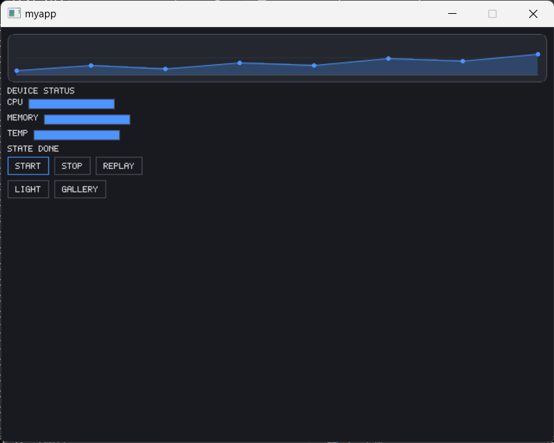
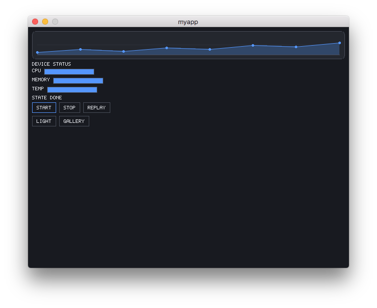
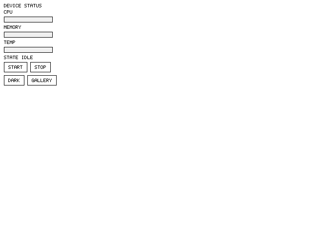
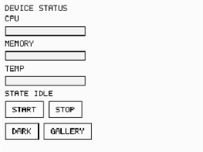

# Imprint UI

> 本文件是英文版 README 的翻译，内容以 [README.md](README.md) 为准（更新至 2026-08-30）。

[](README.md) [](README.zh-CN.md) [](README.ja.md)

[](LICENSE)
[]()
[]()

**一套 GUI 代码，到处运行——甚至包括任天堂 DS。**

Imprint UI 是一个极小的、零依赖、软件渲染的 C++17 GUI 框架，面向嵌入式与非传统目标。同一份 UI 源码树可以编译到 Windows、Linux、macOS、浏览器（WebAssembly）和任天堂 DS——在 PC 上开发预览，然后把**完全相同的代码**发布到设备上。

**一份 UI 源码树。一个像素缓冲。多个目标。**


**[在浏览器里直接试](https://tyouhyou.github.io/imprint/)** —— 上面的页面是 WebAssembly 构建；任天堂 DS 画面来自同一份源码的 devkitARM 构建。


同一份 showcase，原样跑在四个原生壳上——包括任天堂 DS 上的 690 KB ROM、60 fps：

<p>
  
  
  
  
</p>

不需要 GPU。不需要操作系统 GUI 工具包。不需要平台专属 UI 代码。

```
              同一份 UI 源码
                    │
        ┌───────────┼───────────┐
        ↓           ↓           ↓
     Windows      Linux       macOS
        │        (X11/FB)       │
        └───────────┼───────────┘
                    ↓
             WebAssembly  ←  浏览器直接试
                    ↓
               任天堂 DS
                    ↓
          你的嵌入式板子（C-ABI）
```

上例 `showcase` 应用的实测体积（Release 构建）：

| 目标 | UI 代码+数据 | RAM（静态） | 帧缓冲 | 交付体积 |
|---|---|---|---|---|
| 任天堂 DS | 543 KB text + 11 KB data | 7.7 KB BSS | 96 KB（256×192×2 B） | 646 KB `.nds` |
| WebAssembly | — | — | 256×192×4 B | 250 KB 单 `.js` 文件，`file://` 直开 |

## 特性

- **保留模式控件树** — `Button`、`Label`、`Dialog`、`FlexPanel`、`GraphicsView` 等
- **设计文件** — 用极简文本格式（`.ui`）描述界面，构建期校验并打包成 C 数组，任何目标平台从数组加载；预览应用可直接渲染文件
- **软件渲染到原始像素缓冲** — 不需要 GPU，不需要外部渲染库；缓冲格式在构建期由 `COLOR_DEPTH` 固定
- **确定性的按需重绘** — 脏标记追踪，主循环归壳层所有，没有隐藏的重绘
- **C-ABI 一等公民** — 稳定的 `zbapi` C 接口，配 Python（ctypes）、WebAssembly 和 C 冒烟测试宿主
- **契约即自动化友好** — "宿主驱动一切"的模型意味着脚本可以直接替代用户：喂输入、泵帧、对像素断言；单线程、无定时器，驱动方无需 sleep——测试集包含端到端 `automation` 套件，全程走公开 API
- **嵌入式级约束** — 无 RTTI、16 位色（abgr1555）、纯整数几何选项、非原子引用计数选项（NDS 没有 libatomic）
- **零分配热路径** — RAII `ClipGuard`、事件墓碑删除、`Subscription`
- **全链路 UTF-8 文本** — 内置 5x7 位图字形兜底（按源码字符串自动子集化）；可选 FreeType（字体）、vendored stb 编解码器（PNG/JPEG）与手写 GIF 编码器
- **C++17、CMake、静态库** — 一切可组合，不强加任何东西

## 非目标

GPU 加速绘制（渲染内核保持 CPU 软件光栅）· 动画/过渡系统 · 运行时后端切换 ·
多线程渲染 · IME 组合 · RTL 排版。Imprint UI 刻意保持极小：一棵控件树、
一个像素缓冲、一路输入流——其余都是宿主的事。

## 快速示例

```cpp
#include "imapp.hpp"
#include "imui.hpp"

int main()
{
    auto app = zb::app::make_app();
    app->create_window(320, 240);
    auto* win = static_cast<zb::app::CanvasWindow*>(app->window().get());

    auto btn = std::make_unique<zb::ui::Button>();
    btn->set_size(100, 40);
    btn->set_text("点我");
    btn->clicked += [] { printf("你好！\n"); };
    win->root().add_child(std::move(btn));

    app->paint();
}
```

同样的界面用设计文件描述（`tools/examples/menu.ui`）：

```
column id="root" spacing=6 padding=10
  label id="title" text="Settings"
  checkbox id="sound" text="Sound"
  slider min=0 max=100 step=10
  list_box rows=3 items="Easy" "Normal" "Hard"
  row spacing=4
    button id="ok" text="OK"
    button id="cancel" text="Cancel"
```

构建期用 `ui_embed` 打包（非法文件直接构建失败），运行时用
`parse_ui_text` + `build()` 物化 — 所有平台同一代码路径。预览交互式查看：

```
UI_PREVIEW_FILES="tools/examples/menu.ui" cmake -B build/build_linux -DSTORY=ui_preview -DIM_SHELL_BACKEND=FB && cmake --build build/build_linux
```

## 构建

| 目标 | 命令 | 说明 |
|---|---|---|
| Windows（MSVC） | `cmake -S . -B build/build_win && cmake --build build/build_win` | 零依赖默认构建（32bpp） |
| Windows + 字体 | `cmake -S . -B build/build_font -DUSE_FONT=ON && cmake --build build/build_font` | 运行需 `freetype.dll` 在 PATH 上 |
| macOS（AppKit） | `cmake -S . -B build/build_mac && cmake --build build/build_mac` | deployment target 11.0，无需额外选项 |
| Linux（X11） | `cmake -S . -B build/build_linux -DIM_SHELL_BACKEND=X11 && cmake --build build/build_linux` | 支持输入的后端 |
| Linux（framebuffer） | `cmake -S . -B build/build_linux -DIM_SHELL_BACKEND=FB && cmake --build build/build_linux` | 仅显示；交互请用 X11 |
| 任天堂 DS | `docker run --rm -v $PWD:/src -w /src devkitpro/devkitarm:20260610 sh -c 'cmake -S . -B build/build_nds -DCMAKE_TOOLCHAIN_FILE=cmake/nds.toolchain.cmake && cmake --build build/build_nds'` | 产出 `build/build_nds/bin/tictactoe.nds`；加 `-DSTORY=showcase` 构建 showcase ROM（还需传入宿主构建的 `ui_embed` 与 `asset_gen`：`-DUI_EMBED_EXECUTABLE=` / `-DASSET_GEN_EXECUTABLE=`） |
| WebAssembly | `demo/wasm/build.sh`（docker emscripten） | 附带 node 冒烟测试 |
| Python | 先构建 `binding` 动态库，再 `SDL_VIDEODRIVER=dummy python3 demo/python/myapp.py --lib <libzbapi>` | ctypes + pygame 宿主 |

测试：`test/test_imui`——纯断言，无测试框架；桌面构建自动运行，NDS 跳过。

## 文档

**建议阅读顺序**（新维护者的第一遍）：
1. [`docs/getting-started.md`](docs/getting-started.md)——跑起第一个应用并改成自己的（约 5 分钟）
2. 本 README → **构建**（在各目标上把二进制跑起来）
3. [`docs/ARCHITECTURE.md`](docs/ARCHITECTURE.md) §1–§2——系统是什么、模块图与依赖规则
4. [`docs/ARCHITECTURE.md`](docs/ARCHITECTURE.md) §3–§5——规范性契约、目标平台、已知限制
5. [`docs/code-contract.md`](docs/code-contract.md)——API 级接口契约
6. [`docs/design-file.md`](docs/design-file.md)——处理 `.ui` 文件时再读

**按任务找文档**：改公开 API → 先改 `code-contract.md`（契约先于 API）· 新目标 / 新像素格式 / 新构建选项 → `docs/backlog.md` 与 ARCHITECTURE §4 · `.ui` 语法或打包 → `design-file.md` · C-ABI 宿主 → `zbapi.h` + ARCHITECTURE §4.8 · 构建/运行命令 → 下方**构建**。

- [`docs/getting-started.md`](docs/getting-started.md)——从克隆到跑起自己的应用：运行 `hello` 示例、理解 `IApp`/`CanvasWindow` 接缝、注册自己的 story
- [`docs/ARCHITECTURE.md`](docs/ARCHITECTURE.md)——按现状实装的架构：模块图与依赖规则、契约（帧生命周期、输入、像素模型、文本、事件、错误处理、C-ABI 宿主、构建选项）、已知限制
- [`docs/backlog.md`](docs/backlog.md)——活跃 Backlog：架构项、产品特性批次（L/I/F）、条件触发项
- [`docs/code-contract.md`](docs/code-contract.md)——API 级接口契约：错误路径、UTF-8/文本、glyph provider、树变更、布局失效、分配预算、呈现接缝转换器
- [`docs/design-file.md`](docs/design-file.md)——`.ui` 设计文件格式：语法、打包管线、物化语义
- [`binding/include/zbapi.h`](binding/include/zbapi.h)——C-ABI 宿主接口；宿主规则见 ARCHITECTURE §4.8

## 示例

**Hello**（`-DSTORY=hello`）——入门应用：一个标签加一个点击计数的按钮；复制它即可开始写自己的应用（见 [`docs/getting-started.md`](docs/getting-started.md)）。

**showcase**（`-DSTORY=showcase`）——多目标蒙太奇背后的控件陈列馆：暗色启动，开场是一幅用框架自身光栅器绘制的动画图表（圆角卡片上的抗锯齿曲线 + 渐变面积，由 app 侧 tween 逐步揭示）；设备状态控制面板（进度条、START/STOP、深/浅主题切换）与全控件页面带 alpha 资产合成（9-slice 阴影卡、accent 染色球；资产由 `tools/asset_gen` 构建期生成）。`assets/showcase/` 中的画面来自这些构建——录制器完全确定，Windows/macOS/Linux 上产出字节级一致的 GIF；WASM 变体可在线游玩（[tyouhyou.github.io/imprint](https://tyouhyou.github.io/imprint/)，本地用 `demo/wasm/build.sh showcase` 构建），同一份源码也构建 NDS ROM。

**井字棋**（默认 story）——人机对战，覆盖对话框、按钮、布局与按需重绘；NDS 构建产出 `build/build_nds/bin/tictactoe.nds`。第三个应用 `ui_preview`（`-DSTORY=ui_preview`）渲染 `UI_PREVIEW_FILES`（空格分隔路径，左右键切换文档）指定的设计文件。

| Windows | macOS | Linux (X11) | WebAssembly | 任天堂 DS | Python 宿主 |
|:---:|:---:|:---:|:---:|:---:|:---:|
|  |  |  |  |  |  |

## 许可证

[MIT](LICENSE) © 2026 tyou hyou
